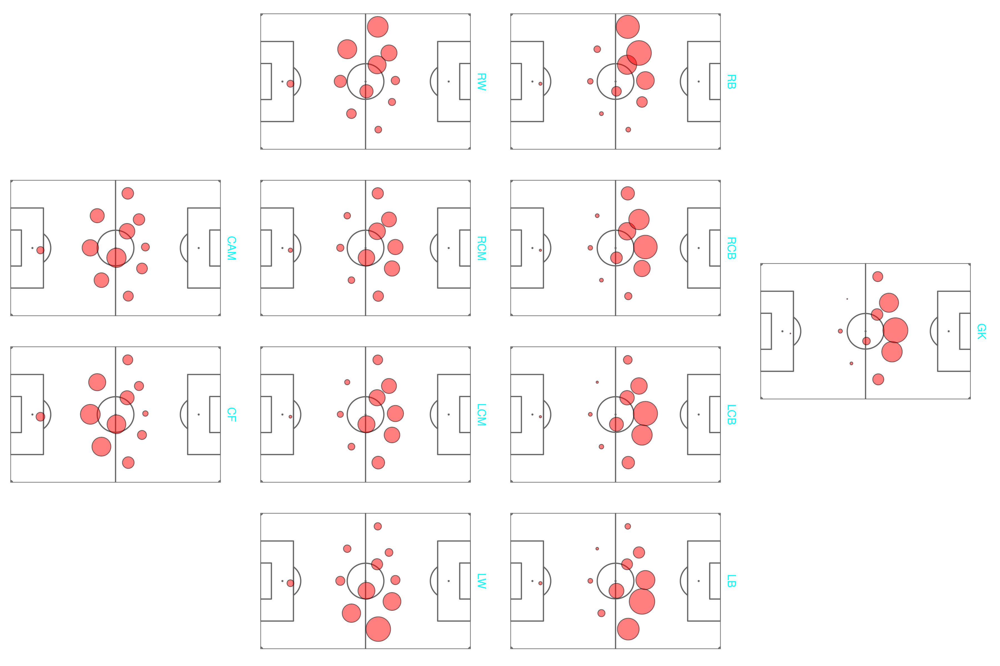

### Quantifying defensive contribution from tracking data

A model to quantify the impact of a player on preventing goals, passes, and carries from happening.

[Stats Preform Pro Forum 2021 Talk](https://vimeo.com/533973203)

[Friends of Tracking talk](https://www.youtube.com/watch?v=Imt8p7ZgnZQ)

[Article in SpaceSpaceSpace](https://spacespacespaceletter.com/whats-tackles-defense-is-about-denying-space/)

[Article in Analytics FC Blog](http://analyticsfc.co.uk/blog/2021/04/26/quantifying-defence-pass-prevention-and-shot-prevention/)
